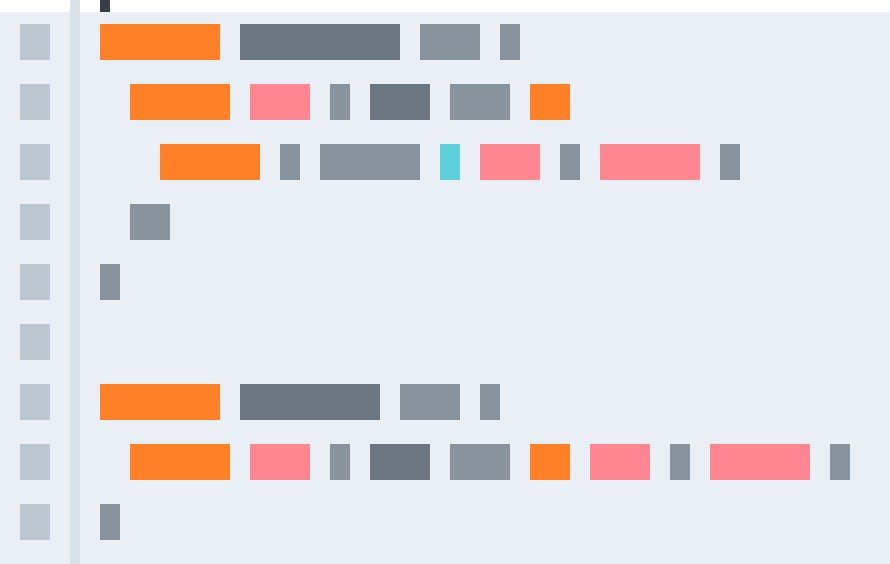

# Flow 中文参考指南

## 在线演示

[http://www.tensweets.com/books/flow/](http://www.tensweets.com/books/flow/)

## 更快

是不是厌倦了运行时测试找出bugs？`Flow`在你编写代码的时候就能识别出问题，不用再浪费时间去推理和测试了。

## 更智能

给`Javascript`这样的动态语言构建智能工具是比较困难的，`Flow`理解你的代码并将其变为可用的知识，从而支持基于`Flow`构建其他智能工具。

## 更自信

对大型代码库做重要的修改是可怕的，`Flow`能帮助你安全地重构，这样你可以集中注意力在想做的修改上，而不用担心可能破坏什么。

## 更大规模

很多开发人员在一个代码库上工作使你的主分支工作起来有点困难，`Flow`可以帮助你预防错误的`rebase`。`Flow`能帮你保护精心设计的库不被误用和误解，并可以帮助你在以后能理解之前的代码。

